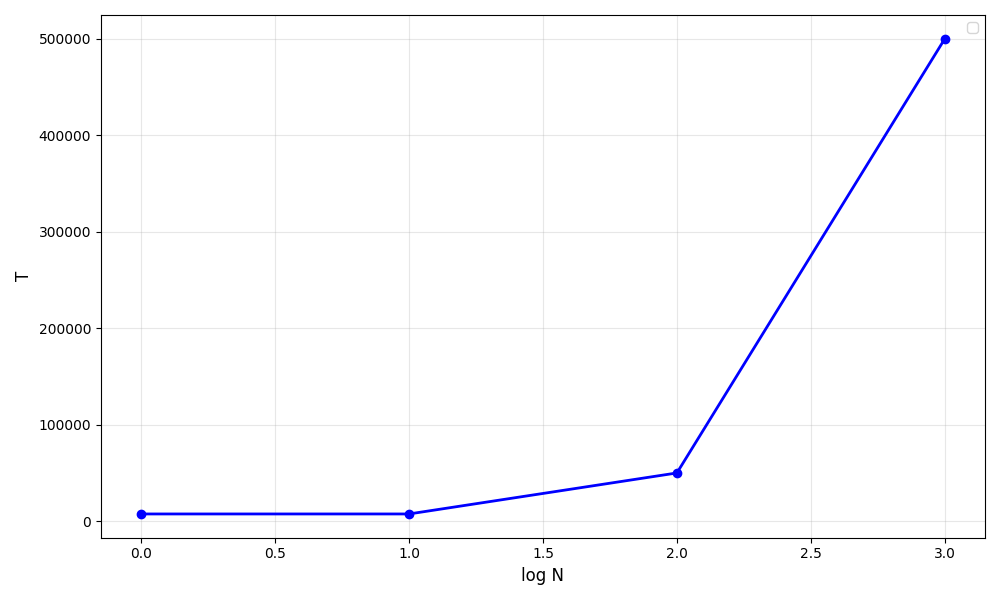

# Практика 5. Прикладной уровень

## Программирование сокетов.

### A. Почта и SMTP (7 баллов)

### 1. Почтовый клиент (2 балла)
Напишите программу для отправки электронной почты получателю, адрес
которого задается параметром. Адрес отправителя может быть постоянным. Программа
должна поддерживать два формата сообщений: **txt** и **html**. Используйте готовые
библиотеки для работы с почтой, т.е. в этом задании **не** предполагается общение с smtp
сервером через сокеты напрямую.

Приложите скриншоты полученных сообщений (для обоих форматов).

#### Демонстрация работы
todo

### 2. SMTP-клиент (3 балла)
Разработайте простой почтовый клиент, который отправляет текстовые сообщения
электронной почты произвольному получателю. Программа должна соединиться с
почтовым сервером, используя протокол SMTP, и передать ему сообщение.
Не используйте встроенные методы для отправки почты, которые есть в большинстве
современных платформ. Вместо этого реализуйте свое решение на сокетах с передачей
сообщений почтовому серверу.

Сделайте скриншоты полученных сообщений.

#### Демонстрация работы
todo

### 3. SMTP-клиент: бинарные данные (2 балла)
Модифицируйте ваш SMTP-клиент из предыдущего задания так, чтобы теперь он мог
отправлять письма с изображениями (бинарными данными).

Сделайте скриншот, подтверждающий получение почтового сообщения с картинкой.

#### Демонстрация работы
todo

---

_Многие почтовые серверы используют ssl, что может вызвать трудности при работе с ними из
ваших приложений. Можете использовать для тестов smtp сервер СПбГУ: mail.spbu.ru, 25_

### Б. Удаленный запуск команд (3 балла)
Напишите программу для запуска команд (или приложений) на удаленном хосте с помощью TCP сокетов.

Например, вы можете с клиента дать команду серверу запустить приложение Калькулятор или
Paint (на стороне сервера). Или запустить консольное приложение/утилиту с указанными
параметрами. Однако запущенное приложение **должно** выводить какую-либо информацию на
консоль или передавать свой статус после запуска, который должен быть отправлен обратно
клиенту. Продемонстрируйте работу вашей программы, приложив скриншот.

Например, удаленно запускается команда `ping yandex.ru`. Результат этой команды (запущенной на
сервере) отправляется обратно клиенту.

#### Демонстрация работы
todo

### В. Широковещательная рассылка через UDP (2 балла)
Реализуйте сервер (веб-службу) и клиента с использованием интерфейса Socket API, которая:
- работает по протоколу UDP
- каждую секунду рассылает широковещательно всем клиентам свое текущее время
- клиент службы выводит на консоль сообщаемое ему время

#### Демонстрация работы
todo

## Задачи

### Задача 1 (2 балла)
Рассмотрим короткую, $10$-метровую линию связи, по которой отправитель может передавать
данные со скоростью $150$ бит/с в обоих направлениях. Предположим, что пакеты, содержащие
данные, имеют размер $100000$ бит, а пакеты, содержащие только управляющую информацию
(например, флаг подтверждения или информацию рукопожатия) – $200$ бит. Предположим, что у
нас $10$ параллельных соединений, и каждому предоставлено $1/10$ полосы пропускания канала
связи. Также допустим, что используется протокол HTTP, и предположим, что каждый
загруженный объект имеет размер $100$ Кбит, и что исходный объект содержит $10$ ссылок на другие
объекты того же отправителя. Будем считать, что скорость распространения сигнала равна
скорости света ($300 \cdot 10^6$ м/с).
1. Вычислите общее время, необходимое для получения всех объектов при параллельных
непостоянных HTTP-соединениях
2. Вычислите общее время для постоянных HTTP-соединений. Ожидается ли существенное
преимущество по сравнению со случаем непостоянного соединения?

#### Решение
На одно соединение приходится пропускная способность $150/10 = 15$ бит/с. По линии связи сигнал будет проходить за $10 / 300 \cdot 10^{-6} = 33.3 \cdot 10^{-9} $ секунд. Время на передачу одного пакета $ 100000 / 15 = 6666.7$ секунд, что кратно больше чем задержки на распространение сигнала, поэтому ими я просто пренебрегу. Время на передачу пакета управляющей информаци $200/15 = 13.3$ секунд.

При установке TCP-соединения, клиент и сервер совершают три посылки пакетов по $200$ бит, что дает $13.3 \cdot 3 = 40$ секунд на установку соединения. Плюс одно подтверждение получения пакета --- $40 + 13.3 = 53.3$ секунд.

1. При непостоянном HTTP-соединении передача одного пакета данных займет $53.3 + 6666.7 = 6720$ секунд. Поскольку после первого пакета клиент параллельно запросит еще 10, каждый из них потребует своей установки HTTP-соединения, а значит каждый отправится за $6720$ секунд, зато все 10 будут посылаться параллельно. Тогда общее затраченное время будет $6720 \cdot 2 = 13440$ секунд.

2. Передача одного пакета занимает столько же, только для последующих $10$ не требуется заново устанавливать соединение, то есть это будет только запрос на получение+передача объекта+подтверждение $13.3\cdot 2 + 6666.7= 6693.3$ секунд на каждый из последующих объектов. Итого при последовательной передаче $6720 + 6693.3 \cdot 10 = 73653$ секунд.

Улучшения нет прям точно, но дело в том что при непостоянном соединении есть параллельная передача пакетов, а при постоянном нет.

### Задача 2 (3 балла)
Рассмотрим раздачу файла размером $F = 15$ Гбит $N$ пирам. Сервер имеет скорость отдачи $u_s = 30$
Мбит/с, а каждый узел имеет скорость загрузки $d_i = 2$ Мбит/с и скорость отдачи $u$. Для $N = 10$, $100$
и $1000$ и для $u = 300$ Кбит/с, $700$ Кбит/с и $2$ Мбит/с подготовьте график минимального времени
раздачи для всех сочетаний $N$ и $u$ для вариантов клиент-серверной и одноранговой раздачи.

#### Решение
При клиент серверной раздаче скорость $u$ не имеет значения, ведь пиры не отдают ничего.

На одного клиента приходится скорость раздачи равная $u_s/N$ Мбит/с, а клиент получает файл со скоростью $d$. Тогда минимальное время на передачу равно $\max (F\cdot N/u_s, F/d)$. 

Посчитаем для разных $N$:

$N=10: t = \max(15000 \cdot 10/30, 15000/2) = 7500$ c.

$N=100: t = \max(15000 \cdot 100/30, 15000/2) = 50000$ c.

$N=1000: t = \max(15000 \cdot 10/30, 15000/2) = 500000$ c.

При одноранговой раздаче  я вообще ничего не понимаю

### Задача 3 (3 балла)
Рассмотрим клиент-серверную раздачу файла размером $F$ бит $N$ пирам, при которой сервер
способен отдавать одновременно данные множеству пиров – каждому с различной скоростью,
но общая скорость отдачи при этом не превышает значения $u_s$. Схема раздачи непрерывная.
1. Предположим, что $\dfrac{u_s}{N} \le d_{min}$.
   При какой схеме общее время раздачи будет составлять $\dfrac{N F}{u_s}$?
2. Предположим, что $\dfrac{u_s}{N} \ge d_{min}$. 
   При какой схеме общее время раздачи будет составлять  $\dfrac{F}{d_{min}}$?
3. Докажите, что минимальное время раздачи описывается формулой $\max\left(\dfrac{N F}{u_s}, \dfrac{F}{d_{min}}\right)$?

#### Решение

1. Сервер обслуживает каждого клиента последовательно, передавая каждому файл за время $\dfrac{F}{u_s}$. Из условия на скорость клиента, он будет принимать файл быстрее, а тогда суммарное время получится $\dfrac{N F}{u_s}$.

2. Теперь сервер будет раздавать файл всем клиентам с равной скоростью. Из ограничения на $d$ понятно, что тогда сервер быстрее раздаст файлы, чем его примет последний клиент. Тогда общее время на передачу будет $\dfrac{F}{d_{min}}$.

3. Пусть $\dfrac{u_s}{N} \le d_{min}$. Тогда понятно, что время раздачи не может быть меньше чем  $\dfrac{N F}{u_s}$, ведь серверу надо послать объем данных равный $NF$ со скоростью $u_s$. При этом из неравенства в предположении $\dfrac{N F}{u_s} > \dfrac{F}{d_{min}}$, а значит время раздачи хотя бы $\max\left(\dfrac{N F}{u_s}, \dfrac{F}{d_{min}}\right)$. 

   Пусть теперь $\dfrac{u_s}{N} \ge d_{min}$. Тогда время раздачи должно быть хотя бы $\dfrac{F}{d_{min}}$, ведь клиент с минимальной скоростью получения файла его в итоге должен получить. Ну и тогда $\dfrac{N F}{u_s} < \dfrac{F}{d_{min}}$, а значит время раздачи тоже хотя бы $\max\left(\dfrac{N F}{u_s}, \dfrac{F}{d_{min}}\right)$. Из пунктов 1 и 2 минимальное время раздачи в точности равно этой формуле.
